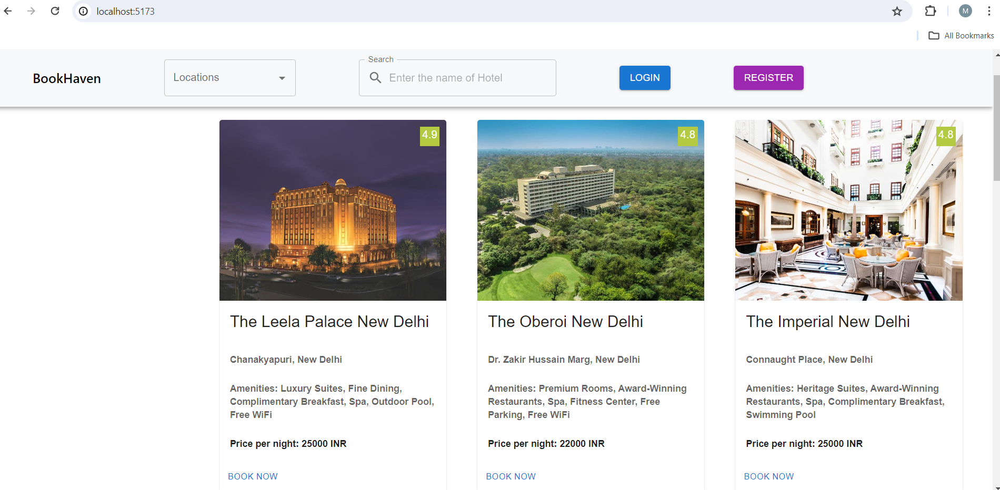
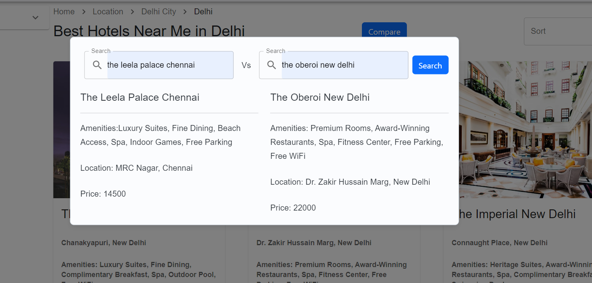
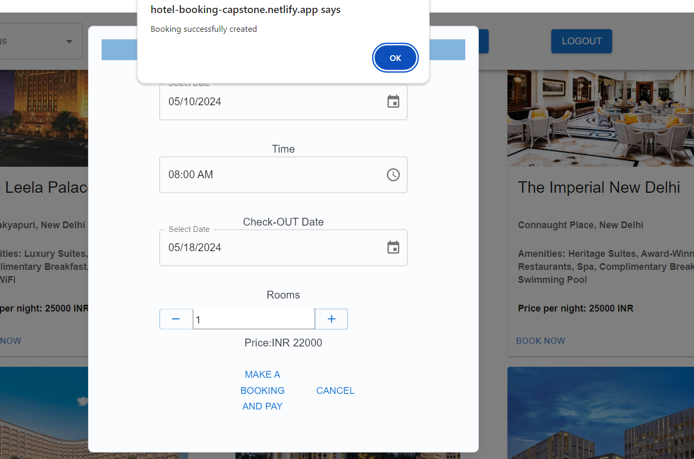
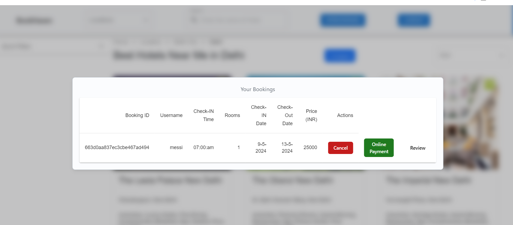
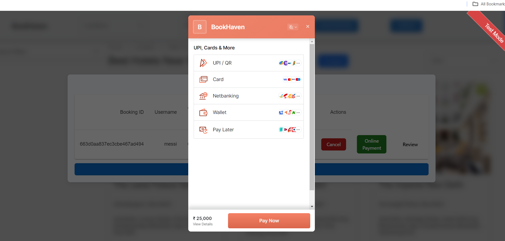
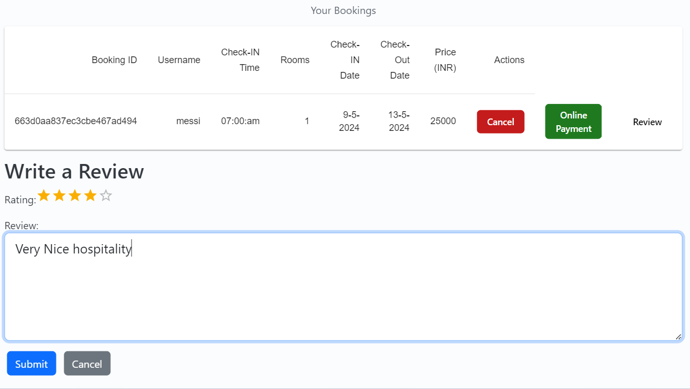

# Project Title :  Hotel booking App

## objective:

- Design and develop an Application using the full-stack.

## Design Phase:

 - Sketch the layout of your application’s interface, focusing on usability and user experience. Use CSS frameworks like Bootstrap for a responsive design that adapts to various screen sizes.

 ## Tech Stacks:

- Front-end: Reactjs 
- Back-end: Nodejs
- Database: MongoDB

 ## Frontend Development:

- Use React for building a dynamic and interactive UI.   
-  Create separate components for the login and registration forms.    
- Use React state and Formik to manage form inputs and validation messages.   
 
 - Utilize React Router for handling client-side routing.   
 - Implement Redux or the Context API for state management across the application.  

 ## Functionality Development:

- Users can view all hotel details including hotel name, price, amenities ,location.    

- Users can search for hotels using the application, providing them with a variety of options based on their preferences.

---------------------------------------------------------------------------

- The app allows users to compare the prices of different hotels, ensuring they find the best deal for their stay using individual components. 

---------------------------------------------------------------------------

- List all view all the booking logs on individual components

- Users can easily reserve hotels and manage their bookings directly within the application.

- Users can easily pay for their stay by clicking mybookings button on the navbar after login.

-------------------------------------------------------------

- Secure payment processing functionality is integrated into the app(by online payment button for payment), ensuring that users can make payments for their bookings conveniently and safely (RazorPay Payment integration).

----------------------------------------------------------------

- Users can leave reviews and ratings for hotels they have stayed at, helping others make informed decisions when booking.

---------------------------------------------------------------